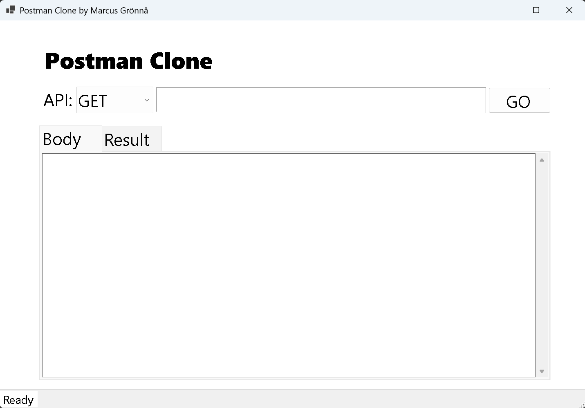
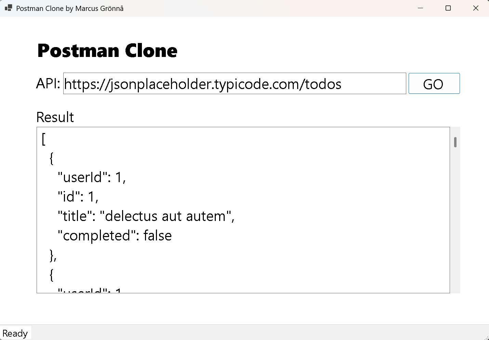
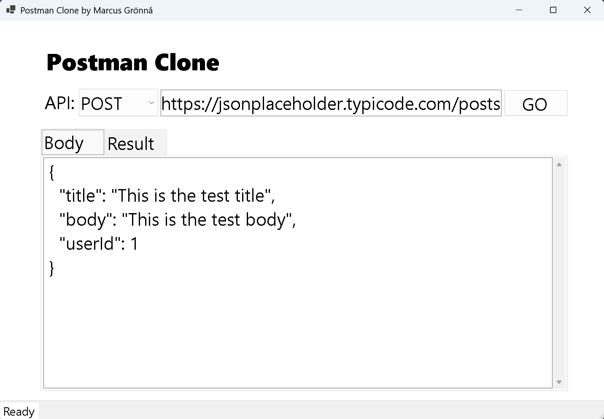
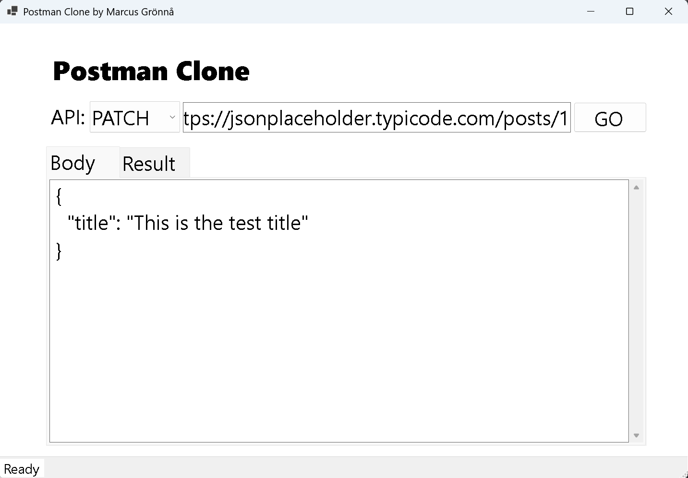

# Postman Clone

This project is a follow-along to Tim Coreys tutorial for making a portfoli project, which is why I can not take any credits for the code. Though I learned a lot of new things and filosophy about the building process of applications and their scalability. For me it was mostly for trying out WinForms and getting accustomed to Visual Studio 2026.

Postman Clone provides a user-friendly interface for making HTTP-requests to APIs and viewing the responses in formatted JSON. Ideal for developers and testers, this tool simplifies API interaction and debugging, helping you efficiently validate and troubleshoot your API calls. It supports full CRUD.

## Technologies Used
* C#
* .NET 10
* WinForms
* HttpClient

## Using The App
1. Download the executable file from the release section.
2. When the application launches it should look like this:



3. Fill in your API URL and hit Go.<br>
   Example url: https://jsonplaceholder.typicode.com/posts   



4. Try out the POST functionality to by adding a body.<br>
   Example url: https://jsonplaceholder.typicode.com/posts<br>
   Example body:
  ```
  {
   "title": "This is the test title",
   "body": "This is the test body",
   "userId": 1
  }
```



5. Or try using the PUT or other HTTP verbs.<br>
   Example url: https://jsonplaceholder.typicode.com/posts/1<br>
   Example body:
 ```
  {
   "title": "This is the test title",
   "body": "This is the test body",
   "userId": 1
  }
```


## Upcoming Changes
* Adding API headers
* Handling API authentication
* Adding Dependency Injection
* Adding Logging
* Create a web-based user interface for the application
